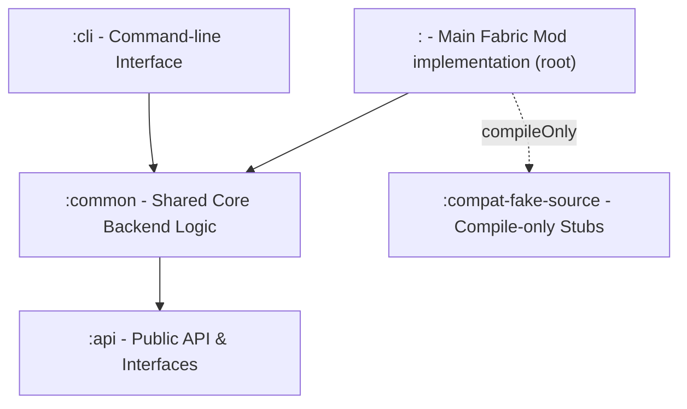
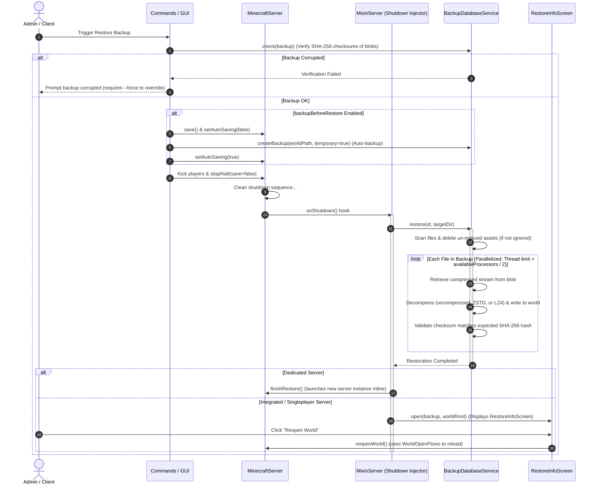
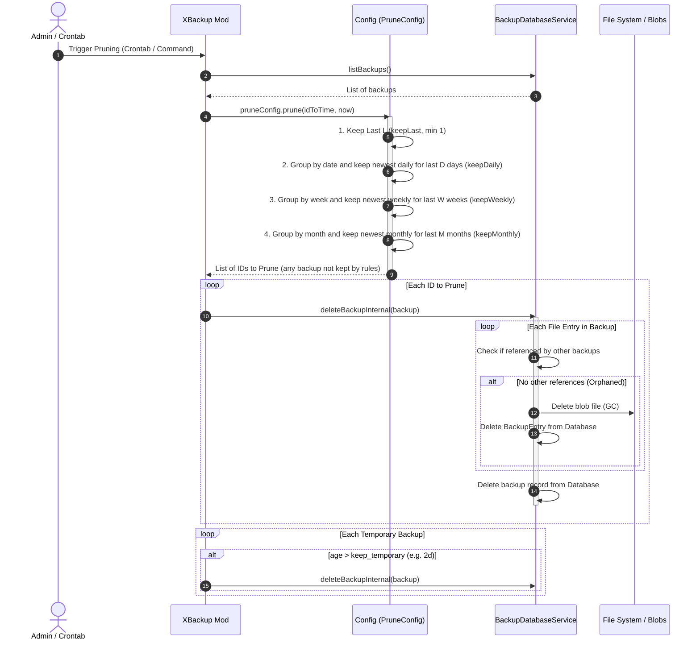

# X Backup Architectural Map

This document maps out the architecture, module layout, file dependencies, and execution flow of the **X Backup** Minecraft mod (designed for Minecraft 26.1.2, running on Java 25).

---

## 1. Project Organization (Gradle Modules)

The project is structured as a multi-module Gradle build, where the root project contains the main Minecraft mod source, and core components are isolated into distinct submodules:

*   **`:api`**: Defines interface boundaries. It holds no external dependencies other than Kotlin/Java standards, allowing other Fabric mods or tools to interface with X Backup without importing heavy transitive dependencies. (Compiles with Java 17)
*   **`:common`**: The functional heart of the backup engine. Handles file walking, database management (SQLite via JetBrains Exposed), Content-Addressable Storage (CAS) logic, GFS retention analysis, and config definitions. (Compiles with Java 17)
*   **`:compat-fake-source`**: A compilation-helper module containing empty compile-only stubs of third-party libraries (such as LuckPerms, fabric-permissions-api, and net.minecraft classes). This permits conditional compilation and soft-dependencies without heavy transitive weight. (Compiles with Java 17)
*   **`:cli`**: A standalone terminal utility. Admins can run this inside a world directory offline to list, backup, restore, or export backups entirely independent of the Minecraft game process. (Compiles with Java 17)
*   **Root Project (`:`)**: The main Fabric Mod. Integrates the common backend logic with the Minecraft/Fabric lifecycle, registers game commands, integrates client options with ModMenu and Yet Another Config Lib (YACL), injects Mixins, and handles UI screens. (Compiles with Java 25)

---

## 2. File-by-File Breakdown & Interactions

### A. The API Module (`:api`)
*   [XBackupApi.java](file:///e:/x-backup/api/src/main/java/com/github/zly2006/xbackup/api/XBackupApi.java): Serves as the static entry point hook (`getInstance`/`setInstance`). Exposes high-level methods to manage backup records, check integrity, delete backups, and get blob locations.
*   [IBackup.kt](file:///e:/x-backup/api/src/main/java/com/github/zly2006/xbackup/api/IBackup.kt) & [IBackupEntry.kt](file:///e:/x-backup/api/src/main/java/com/github/zly2006/xbackup/api/IBackupEntry.kt): Immutable data contracts representing a completed backup metadata envelope and the individual files indexed within it. Entries track content identity via a **SHA-256 hash**.
*   [XBackupKotlinAsyncApi.kt](file:///e:/x-backup/api/src/main/java/com/github/zly2006/xbackup/api/XBackupKotlinAsyncApi.kt): Provides Kotlin coroutine extensions (such as `suspend fun restore`) and raw SQLite database transaction hooks (`dbQuery`).

### B. The Common Backend Module (`:common`)
*   [BackupDatabaseService.kt](file:///e:/x-backup/common/src/main/kotlin/com/github/zly2006/xbackup/BackupDatabaseService.kt):
    *   **Responsibility**: Implements `XBackupKotlinAsyncApi`. Connects to the SQLite database via JetBrains Exposed.
    *   **Key Logic**:
        *   *Content-Addressable Storage (CAS)*: Walks files, computes **SHA-256 hashes** using JVM-native `MessageDigest`, and compresses newly encountered files into the blob store. Relies on `BackupEntryTable`, `BackupTable`, and `BackupEntryBackupTable` to achieve perfect file-level deduplication.
        *   *In-Memory Hashing/Compression Threshold*: Processes files <= 5MB entirely in memory using a `ByteArrayOutputStream` to avoid the slow disk temporary file overhead on Windows (NTFS), writing directly to the final destination if the blob does not exist yet. Files > 5MB are written to temporary files on disk to prevent heap memory exhaustion.
        *   *In-Memory Database Caching*: Loads all existing database entries on backup start, grouping them by path and hash to allow instant O(1) in-memory lookups instead of executing thousands of SQL SELECT queries.
        *   *Batch Database Insertion*: Collects all directories, matched blobs, and compressed file entries in a thread-safe queue (`entriesToInsert`) and writes them to the DB in a single batch transaction. Batch-inserts relation mappings in `BackupEntryBackupTable` at the end of the backup.
        *   *I/O Stream Buffer Optimization*: Uses a 64KB data streaming buffer size (up from 8KB) for hashing and compression, reducing system calls by 8x to maximize NVMe SSD throughput.
        *   *Parallel Resource Limiting*: Throttles coroutine thread pool usage during backup walks and file hashing using `.limitedParallelism(availableProcessors / 2)` to prevent CPU exhaustion on large servers.
        *   *ZSTD / LZ4 Compression*: Supports ZSTD (default, configurable levels 1-5) and LZ4 (fast, levels 1-5) compression. Legacy GZIP and ZIP compressions are no longer supported. Files under 1KB are stored uncompressed to avoid compression overhead.
        *   *Restoration*: Compares target directory state with database indexes, deletes unindexed files, and streams blobs back to disk using a limited coroutine dispatcher (`limitedParallelism`) while validating file integrity with a **SHA-256 check**.
        *   *GC/Packing*: Bundles files smaller than 50MB into joint Zip files to keep file system inode counts low, and garbage-collects orphaned blobs (`deleteUnusedBlobs`).
        *   *Windows Lock Resilience*: Employs `clearDatabase()` which drops and recreates schema table by table within database transactions to resolve SQLite file locking issues during `/xb delete-all` on Windows.
*   [Config.kt](file:///e:/x-backup/common/src/main/kotlin/com/github/zly2006/xbackup/Config.kt): Configures backup intervals, exclusions, and retention options.
    *   *Standard GFS Retention Policy*: Implements integer-based Grandfather-Father-Son (GFS) configuration parameters: `keepLast` (min 1), `keepDaily`, `keepWeekly`, and `keepMonthly`, alongside temporary backup cleanup (`keepTemporary`).
    *   *Backup Optimization Settings*: Configures options like `pauseAutomaticBackupsWithoutPlayers` and `discardEmptyBackups` to prevent redundant backups.
    *   *Broadcast Controls*: Exposes configuration variables `broadcastBackupInChat` and `onlyBroadcastToOp` to control chat logging and reduce log spam.
    *   *Scheduler Mode Config*: Configures `scheduler_mode` (`REAL_TIME` vs `GAME_TIME`) to support scheduled backups based on ticks rather than real time.
    *   *Custom Message Templates*: Contains configurable string templates for start, finish, and progress notifications.
*   [I18n.kt](file:///e:/x-backup/common/src/main/kotlin/com/github/zly2006/xbackup/I18n.kt): Resolves translation JSON resources (`en_us.json`, etc.) for chat prompts and command errors.
*   [Utils.kt](file:///e:/x-backup/common/src/main/kotlin/com/github/zly2006/xbackup/Utils.kt): Houses generic backend retry mechanisms (with special-cased `CancellationException` pass-through) and input stream SHA-256 / checksum computing utilities (`retry`, `digest`).

### C. The Main Mod Module (`/src`)
*   [XBackup.kt](file:///e:/x-backup/src/main/kotlin/com/github/zly2006/xbackup/XBackup.kt):
    *   **Responsibility**: Main Fabric `ModInitializer`.
    *   **Interactions**: 
        *   Hooks into server startup (`SERVER_STARTED`) to initialize the database and Database Service.
        *   Spins up the background auto-backup crontab coroutine thread, utilizing `lastBackupAttemptTime`, `lastBackupAttemptTick`, and a log rate limiter (`hasLoggedSkip`) to support either `REAL_TIME` or `GAME_TIME` (tick-based) scheduling modes.
        *   Enforces dynamic config updates for backup storage paths at runtime without requiring a server restart.
        *   *Database Migration*: Automatically checks for legacy databases on startup and renames them to `x_backup.db.legacy` (along with `.db-wal` and `.db-shm` files to prevent conflicts). It scans both the active `x_backup.db` and all backup databases stored inside the `xb.backups/` snapshot directory. It identifies legacy databases by checking for GZIP/ZIP (`compress = 1` or `compress = 2`) or checking if the hash values are 32-character hex strings (legacy MD5 hashes instead of 64-character SHA-256 hashes).
        *   *Player Activity Tracker*: Tracks player connections to pause automatic backups when no players are active (`playersLoggedOnSinceLastBackup` flag).
*   [Commands.kt](file:///e:/x-backup/src/main/kotlin/com/github/zly2006/xbackup/Commands.kt):
    *   **Responsibility**: Registers command dispatch trees under `/xb` (and `/mirror` if in mirror mode) using Brigadier.
    *   **Interactions**: Exposes backup creation (`/xb create`), deletion (`/xb delete`), list queries (`/xb list`), and info stats.
        *   `/xb delete-all`: Completely wipes the database, deletes all blobs, and recursively deletes the `xb.backups/` snapshot directory (confirm required).
        *   *Regional Restores*: `/xb restore <id> --chunk <from> <to>` reads block coordinates to isolate changes to affected `.mca`/`.mcc` region files only.
        *   *Other Commands*: Config reloading, backup checking (`check`), zipping, and manual GFS pruning.
*   [RemoteSyncService.kt](file:///e:/x-backup/src/main/kotlin/com/github/zly2006/xbackup/RemoteSyncService.kt): Handles asynchronous copying or pushing of backups to a remote target (Git repository or local directory). Manages connection verification, parallel file copies, progress logging, and error handling for remote operations.
*   [RestartUtils.kt](file:///e:/x-backup/src/main/kotlin/com/github/zly2006/xbackup/RestartUtils.kt): Evaluates Java Runtime Management parameters to generate native restart command lists (Unix/Windows) to hot-restart the JVM.
*   [Task.kt](file:///e:/x-backup/src/main/kotlin/com/github/zly2006/xbackup/Task.kt): Interface defining the contract for asynchronous operations with status, timing tracking, and progress metrics.
*   [Utils.kt](file:///e:/x-backup/src/main/kotlin/com/github/zly2006/xbackup/Utils.kt): Extends `MinecraftServer` and `CommandSourceStack` with helper functions for auto-saving toggle, sync writes execution, system messages, and chat broadcasts (which filter messages based on OP level and console log routing). Includes a robust text template formatter mapping over 30 custom placeholders (covering system metrics, size information, file counts, and date/time formatting).
*   [gui/ConfigGui.kt](file:///e:/x-backup/src/main/kotlin/com/github/zly2006/xbackup/gui/ConfigGui.kt): Yet Another Config Lib (YACL) options GUI mapping general settings, GFS parameters, Chat Notifications, Message Templates (custom broadcast messages), and ZSTD/LZ4 compression levels.
*   [client/ModMenuIntegration.kt](file:///e:/x-backup/src/main/kotlin/com/github/zly2006/xbackup/client/ModMenuIntegration.kt): Registers the config screen with ModMenu.
*   [client/XBackupClient.kt](file:///e:/x-backup/src/main/kotlin/com/github/zly2006/xbackup/client/XBackupClient.kt): Client-side mod initializer (`ClientModInitializer`) placeholder.
*   [gui/BackupsGui.kt](file:///e:/x-backup/src/main/kotlin/com/github/zly2006/xbackup/gui/BackupsGui.kt): PolyLib modular GUI displaying and managing world backups in the Singleplayer Select World menu.
*   [gui/RestoreInfoScreen.kt](file:///e:/x-backup/src/main/kotlin/com/github/zly2006/xbackup/gui/RestoreInfoScreen.kt): Minecraft screen rendering restoration progress. Allows players to reopen the world or close the screen.
*   [gui/BMStyle.java](file:///e:/x-backup/src/main/java/com/github/zly2006/xbackup/gui/BMStyle.java) & [gui/OptionDialog.java](file:///e:/x-backup/src/main/java/com/github/zly2006/xbackup/gui/OptionDialog.java): Standard theme styling definitions and confirmation dialog wrappers for PolyLib.
*   [ktdsl/Commands.kt](file:///e:/x-backup/src/main/kotlin/com/github/zly2006/xbackup/ktdsl/Commands.kt): Brigadier command builder DSL allowing cleaner registration structures.
*   [mixin/MixinSelectWorldScreen.java](file:///e:/x-backup/src/main/java/com/github/zly2006/xbackup/mixin/MixinSelectWorldScreen.java): Injects the backups list GUI shortcut button ("回") into the Singleplayer select world menu if PolyLib is loaded.
*   [mixin/MixinServer.java](file:///e:/x-backup/src/main/java/com/github/zly2006/xbackup/mixin/MixinServer.java): Prevents standard world auto-saving when a backup is running, and hooks shutdown completion (`stopServer` tail) to run the restoration logic.
*   [mixin/compat/MixinLuckPermsPlugin.java](file:///e:/x-backup/src/main/java/com/github/zly2006/xbackup/mixin/compat/MixinLuckPermsPlugin.java): Bypasses LuckPerms executor shutdown routines during restore cycles.
*   [mixin/disable/MixinDedicatedServerWatchdog.java](file:///e:/x-backup/src/main/java/com/github/zly2006/xbackup/mixin/disable/MixinDedicatedServerWatchdog.java): Extends watchdog limits during slow backup operations to prevent servers from being killed.
*   [mixin/disable/MixinStorageIoWorker.java](file:///e:/x-backup/src/main/java/com/github/zly2006/xbackup/mixin/disable/MixinStorageIoWorker.java): Empty mixin placeholder class targeting chunk storage worker controls.

### D. The CLI Module (`:cli`)
*   [Main.kt](file:///e:/x-backup/cli/src/main/kotlin/Main.kt):
    *   **Responsibility**: Entry point for the offline CLI tool.
    *   **Interactions**: Loads localized configuration databases and runs a terminal loop directly in the world folder to support list, backup, restore, and export functions offline.

---

## 3. Core Execution Flow Diagrams

### A. Backup Creation Process

```mermaid
sequenceDiagram
    autonumber
    actor Admin as Admin / Crontab
    participant Mod as XBackup Mod / Crontab
    participant MS as MinecraftServer
    participant DB as BackupDatabaseService
    participant Disk as File System / Blobs

    Admin->>Mod: Trigger Backup (Manual or Scheduled)
    
    rect rgb(25, 25, 40)
        note right of Mod: Scheduled Backup Check
        alt pauseAutomaticBackupsWithoutPlayers Enabled
            Mod->>MS: Get online player count
            alt Players Offline & No Active Logins since last backup
                alt skip log has not been printed yet
                    Mod->>Mod: Log "Skipping scheduled backup..." (once)
                end
                Mod-->>Admin: Skip scheduled backup (Silent delay)
            end
        end
    end

    Mod->>MS: save() (Flush world changes to disk)
    Mod->>MS: setAutoSaving(false) (Lock files)
    Mod->>DB: createBackup(worldPath)
    activate DB
    DB->>Disk: Walk world files
    loop Each File (Parallelized: Thread limit = availableProcessors / 2)
        DB->>DB: Check if ignored (Config::ignoredFiles)
        DB->>DB: Check if file matches existing DB entry (path, directory state, size, lastModified)
        alt Cache Miss
            alt File Size > 1024 bytes
                DB->>Disk: Compress using ZSTD or LZ4 (Config::compressionAlgorithm)
                DB->>Disk: Save to blob store /blob/xx/xxxxxxxx
            else Size <= 1024 bytes
                DB->>Disk: Save uncompressed
            end
            DB->>DB: Compute SHA-256 Hash (JVM-Native)
        end
        DB->>DB: Record SHA-256 hash & reference in SQLite database
    end
    
    alt discardEmptyBackups Enabled & No New Blobs Added
        DB-->>Mod: Return result: EMPTY_BACKUP
    else
        DB-->>Mod: Return Backup Summary
    end
    deactivate DB

    alt success
        Mod->>Disk: Perform Database SQLite 'VACUUM INTO'
        Mod->>Disk: Move to ./xb.backups/<id>/x_backup.db
        Mod->>Disk: Prune extra database backups (keep newest 5)
        note right of Mod: Chat Broadcast Control
        alt broadcastBackupInChat Enabled
            alt onlyBroadcastToOp Enabled
                Mod->>MS: Send system message only to OP players
            else
                Mod->>MS: Broadcast message to all players
            end
        end
        Mod-->>Admin: Log success message to server log with duration (s)
    else EMPTY_BACKUP
        Mod-->>Admin: Log: Backup cancelled (no changes detected)
    else error
        Mod-->>Admin: Log failure message to server log
    end

    Mod->>MS: setAutoSaving(true) (Unlock files)
```

### B. Restore Process
Minecraft region files cannot be overwritten while the game is running. X Backup intercepts the shutdown loop to perform restorations.

### C. Pruning and Retention Process (GFS & CAS Garbage Collection)

Pruning runs automatically as part of the background crontab job (if enabled) or manually via the `/xb prune` command. It evaluates existing backups using standard Grandfather-Father-Son (GFS) configuration integers, and cleans up the Content-Addressable Storage (CAS) blob store by deleting unreferenced files (Garbage Collection).

---

## 4. Third-Party Library & Build Dependencies

Dependencies are declared globally in `gradle.properties` and resolved contextually inside `build.gradle.kts`:

| Dependency | Purpose | Scope | Notes |
| :--- | :--- | :--- | :--- |
| **Fabric Loom** | Compilation environment | Build system | Compiles the mod against Minecraft 26.1.2; version `1.16-SNAPSHOT` |
| **Fabric Language Kotlin** | Kotlin standard libraries loading in MC | Runtime & compile | Direct loader dependency; version `1.13.11+kotlin.2.3.21` |
| **JetBrains Exposed** | SQL ORM library | Shadowed & compiled | Handles connection pooling and queries; version `0.61.0` |
| **SQLite-JDBC** | Database driver for SQLite | Shadowed & compiled | Drives local `x_backup.db` storage |
| **Yet Another Config Lib (YACL)** | Configuration GUI | CompileOnly / Runtime | Used to build modern configuration screen; version `3.9.2+26.1-fabric` |
| **PolyLib** | Client Modular GUI controls | CompileOnly / Optional | Enables the "回" backup button in Singleplayer; version `26.1.2-2.0.6` |
| **LuckPerms / Perms API** | Permission validation | CompileOnly | Extracted from `compat-fake-source` |
| **ZSTD-JNI** | ZStandard compression | Shadowed & compiled | Used for default backup compression |
| **LZ4-Java** | LZ4 compression | Shadowed & compiled | Used for high-speed backup compression |
| **Git CLI** | Version control & remote push/pull sync | Runtime (Optional) | Required for remote Git sync features |
