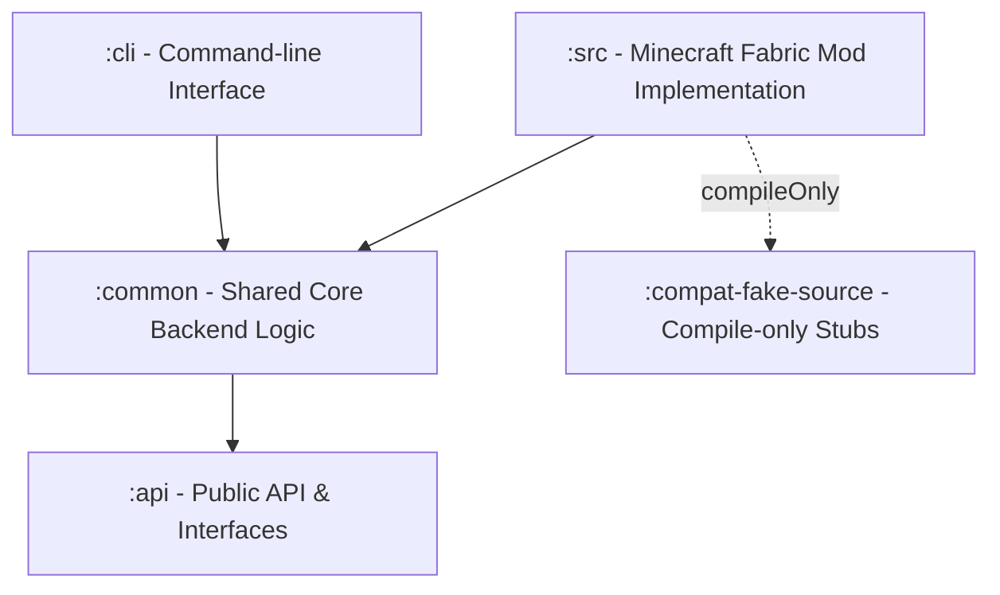
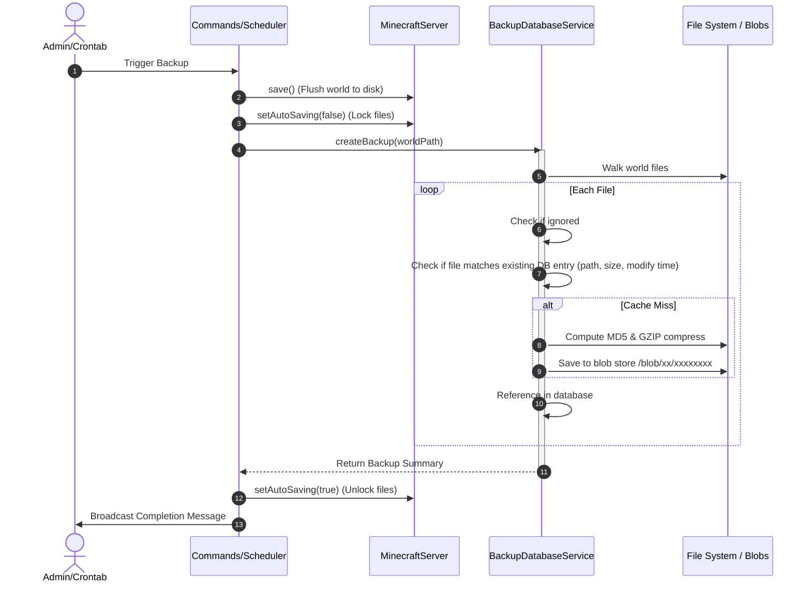
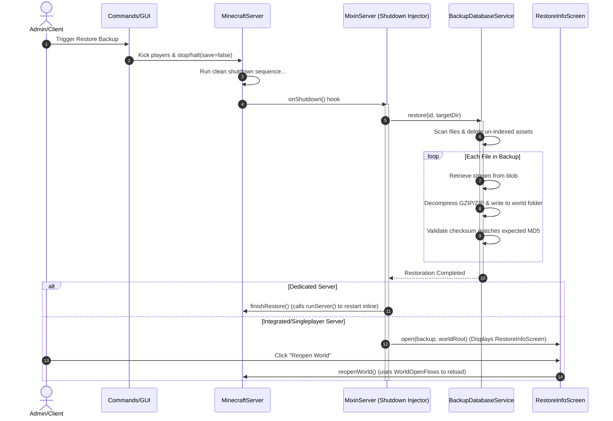
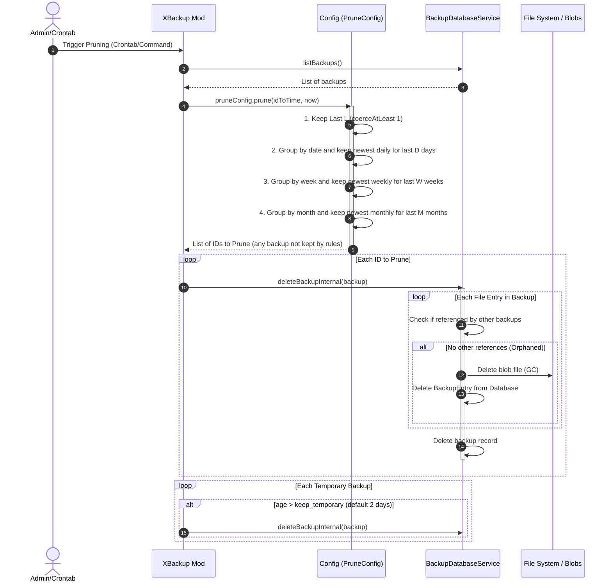

# X Backup Architectural Map

This document maps out the architecture, module layout, file dependencies, and execution flow of the **X Backup** Minecraft mod (designed for Minecraft 26.1.2, running on Java 25).

---

## 1. Project Organization (Gradle Modules)

The project is structured as a multi-module Gradle build:

*   **`:api`**: Defines interface boundaries. It holds no external dependencies other than JetBrains Exposed and Kotlin/Java standards, allowing other mods to interact with X Backup without importing full dependencies. (Compiles with Java 17)
*   **`:common`**: The functional heart. Handles file walking, hashing, deduplication database (SQLite), and configuration settings. (Compiles with Java 17)
*   **`:compat-fake-source`**: A compilation-helper module containing empty stubs of third-party libraries (like LuckPerms, fabric-permissions-api, and net.minecraft classes). This permits conditional compiles without declaring heavy transitive dependencies. (Compiles with Java 17)
*   **`:cli`**: A standalone terminal tool. Admins can run this inside a world directory to list, back up, or restore worlds entirely offline. (Compiles with Java 17)
*   **`:src` (Main Mod)**: Extends `:common` to tie into the Fabric/Minecraft lifecycle, adding game commands, user interfaces, mixins, and network integrations (OneDrive). Pinned to Minecraft 26.1.2 (unobfuscated, compiles with Java 25).

---

## 2. File-by-File Breakdown & Interactions

### A. The API Module (`:api`)
*   [XBackupApi.java](file:///e:/x-backup/api/src/main/java/com/github/zly2006/xbackup/api/XBackupApi.java): Serves as the static entry point hook (`getInstance`/`setInstance`). Exposes high-level methods to request backups, check integrity, delete backups, or restore targets.
*   [IBackup.kt](file:///e:/x-backup/api/src/main/java/com/github/zly2006/xbackup/api/IBackup.kt) & [IBackupEntry.kt](file:///e:/x-backup/api/src/main/java/com/github/zly2006/xbackup/api/IBackupEntry.kt): Immutable data contracts representing a completed backup metadata envelope and the individual files indexed within it.
*   [CloudStorageProvider.kt](file:///e:/x-backup/api/src/main/java/com/github/zly2006/xbackup/api/CloudStorageProvider.kt): Interface defining asynchronous cloud upload triggers and speed telemetry hooks.
*   [XBackupKotlinAsyncApi.kt](file:///e:/x-backup/api/src/main/java/com/github/zly2006/xbackup/api/XBackupKotlinAsyncApi.kt): Provides Kotlin coroutine extensions (like `suspend fun restore`) and raw SQLite database transaction hooks (`dbQuery`).

### B. The Common Backend Module (`:common`)
*   [BackupDatabaseService.kt](file:///e:/x-backup/common/src/main/kotlin/com/github/zly2006/xbackup/BackupDatabaseService.kt):
    *   **Responsibility**: Implements `XBackupKotlinAsyncApi`. Connects to the SQLite database via JetBrains Exposed.
    *   **Key Logic**:
        *   *Content-Addressable Storage (CAS)*: Walks files, computes MD5 hashes, and compresses newly encountered files into the GZIP/ZIP blob store. Relies on `BackupEntryTable`, `BackupTable`, and `BackupEntryBackupTable` to achieve perfect file-level deduplication.
        *   *Restoration*: Compares target directory state with database indexes, deletes un-indexed files, and streams blobs back to disk while checking MD5 integrity.
        *   *GC/Packing*: Bundles files smaller than 50MB into joint Zip files to keep file system inode counts low, and garbage-collects orphaned blobs (`deleteUnusedBlobs`).
*   [Config.kt](file:///e:/x-backup/common/src/main/kotlin/com/github/zly2006/xbackup/Config.kt): Configures backup intervals, exclusions, and pruning limits. Implements a calendar-based standard GFS pruning evaluator (Keep Last, Keep Daily, Keep Weekly, Keep Monthly).
*   [I18n.kt](file:///e:/x-backup/common/src/main/kotlin/com/github/zly2006/xbackup/I18n.kt): Resolves translation JSON resources (`en_us.json`, `zh_cn.json`) for chat prompts and command errors.
*   [Utils.kt](file:///e:/x-backup/common/src/main/kotlin/com/github/zly2006/xbackup/Utils.kt): Houses generic backend retry mechanisms and input stream checksum computing utilities (`retry`, `digest`).

### C. The Main Mod Module (`:src`)
*   [XBackup.kt](file:///e:/x-backup/src/main/kotlin/com/github/zly2006/xbackup/XBackup.kt):
    *   **Responsibility**: Main Fabric `ModInitializer`.
    *   **Interactions**: Hooks into server startup (`SERVER_STARTED`) to initialize `BackupDatabaseService` pointing to the world's database, spins up the background auto-backup crontab coroutine thread, and registers `/xb` command handlers.
*   [Commands.kt](file:///e:/x-backup/src/main/kotlin/com/github/zly2006/xbackup/Commands.kt):
    *   **Responsibility**: Registers `/xb` (and `/mirror` if in mirrorMode) command dispatch trees using the brigadier command registration.
    *   **Interactions**: Interacts with the `BackupDatabaseService` to trigger backups, and controls Minecraft servers (e.g., saving worlds, stopping watchdogs, and launching restores). Supports regional restores (`--chunk`) by checking coordinates inside chunk region files (`.mca`/`.mcc`).
*   [RestartUtils.kt](file:///e:/x-backup/src/main/kotlin/com/github/zly2006/xbackup/RestartUtils.kt): Evaluates Java Runtime Management parameters to generate native restart command lists (Unix/Windows) to hot-restart the JVM.
*   [Task.kt](file:///e:/x-backup/src/main/kotlin/com/github/zly2006/xbackup/Task.kt): Interface defining contract for asynchronous operations with status, timing tracking, and progress metrics.
*   [Utils.kt](file:///e:/x-backup/src/main/kotlin/com/github/zly2006/xbackup/Utils.kt): Extends `MinecraftServer` and `CommandSourceStack` with inline functions for auto-saving toggle, sync writes execution, system messages, and state reset hooks (`finishRestore`).
*   [gui/BackupsGui.kt](file:///e:/x-backup/src/main/kotlin/com/github/zly2006/xbackup/gui/BackupsGui.kt): PolyLib modular GUI displaying and managing world backups in the Singleplayer Select World menu. Extracts `icon.png` from backup entries.
*   [gui/RestoreInfoScreen.kt](file:///e:/x-backup/src/main/kotlin/com/github/zly2006/xbackup/gui/RestoreInfoScreen.kt): Minecraft screen rendering restoration progress using the modern `extractRenderState(context: GuiGraphicsExtractor, ...)` method. Allows players to reopen the world or close the screen.
*   [gui/BMStyle.java](file:///e:/x-backup/src/main/java/com/github/zly2006/xbackup/gui/BMStyle.java) & [gui/OptionDialog.java](file:///e:/x-backup/src/main/java/com/github/zly2006/xbackup/gui/OptionDialog.java): Standard theme styling definitions and confirmation dialog wrappers for PolyLib.
*   [ktdsl/Commands.kt](file:///e:/x-backup/src/main/kotlin/com/github/zly2006/xbackup/ktdsl/Commands.kt): Brigadier command builder DSL allowing cleaner registration structures.
*   [mixin/MixinSelectWorldScreen.java](file:///e:/x-backup/src/main/java/com/github/zly2006/xbackup/mixin/MixinSelectWorldScreen.java): Injects the backups list GUI shortcut button ("回") into the Singleplayer select world menu if PolyLib is loaded.
*   [mixin/MixinServer.java](file:///e:/x-backup/src/main/java/com/github/zly2006/xbackup/mixin/MixinServer.java): Prevents standard world auto-saving when a backup is running, and hooks shutdown completion (`stopServer` tail) to run the restoration logic.
*   [mixin/compat/MixinLuckPermsPlugin.java](file:///e:/x-backup/src/main/java/com/github/zly2006/xbackup/mixin/compat/MixinLuckPermsPlugin.java): Bypasses LuckPerms executor shutdown routines during restore cycles.
*   [mixin/disable/MixinDedicatedServerWatchdog.java](file:///e:/x-backup/src/main/java/com/github/zly2006/xbackup/mixin/disable/MixinDedicatedServerWatchdog.java): Extends watchdog limits during slow backup operations to prevent servers from being killed.

### D. The CLI Module (`:cli`)
*   [Main.kt](file:///e:/x-backup/cli/src/main/kotlin/Main.kt):
    *   **Responsibility**: Entry point for the offline CLI tool.
    *   **Interactions**: Loads localized configuration databases and runs a terminal loop directly in the world folder to support list, backup, restore, and export functions offline.

---

## 3. Core Execution Flow Diagrams

### A. Backup Creation Process

### B. Restore Process
Minecraft region files cannot be overwritten while the game is running. X Backup intercepts the shutdown loop to perform restorations.

### C. Pruning and Retention Process (GFS & CAS Garbage Collection)

Pruning runs automatically as part of the background crontab job (if enabled) or manually via the `/xb prune` command. It evaluates existing backups using a custom Grandfather-Father-Son (GFS) pruning policy, and cleans up the Content-Addressable Storage (CAS) blob store by deleting unreferenced files (Garbage Collection).

---

## 4. Third-Party Library & Build Dependencies

Dependencies are declared globally in `gradle.properties` and resolved contextually inside `build.gradle.kts`:

| Dependency | Purpose | Scope | Notes |
| :--- | :--- | :--- | :--- |
| **Fabric Loom** | Compilation environment | Build system | Compiles the mod against Minecraft 26.1.2 |
| **Fabric Language Kotlin** | Kotlin standard libraries loading in MC | Runtime & compile | Direct loader dependency |
| **JetBrains Exposed** (`exposed-version`) | SQL ORM library | Shadowed & compiled | Handles connection pooling and queries |
| **SQLite-JDBC** | Database driver for SQLite | Shadowed & compiled | Drives local `x_backup.db` storage |
| **Ktor Client** (`ktor_version`) | HTTP requests & Serialization | Shadowed & compiled | Drives OneDrive upload communications |
| **PolyLib** (`deps.poly_lib`) | Client Modular GUI controls | CompileOnly/Optional | Enables the "回" backup button in Singleplayer; version `26.1.2-2.0.6` |
| **LuckPerms / Perms API** | Permission validation | CompileOnly | Extracted from `compat-fake-source` |
